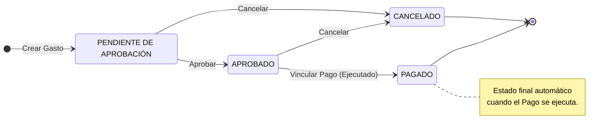
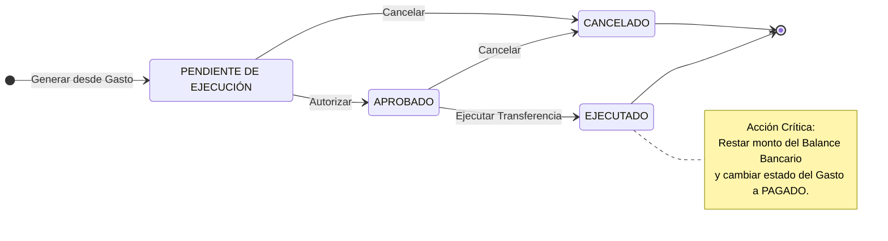

# Gestión de Gastos y Pagos

## Requerimientos Funcionales

### Gestión del Ciclo de Vida del Gasto (Gastos)

2\. Requerimientos Funcionales (RF)
-----------------------------------

### RF1: Gestión del Ciclo de Vida del Gasto

El sistema debe permitir registrar gastos y gestionar sus estados.

- PENDIENTE: Estado inicial al crear un gasto. Datos requeridos: Monto, Concepto, Fecha Creación.
- APROBADO: El gasto ha sido validado por un supervisor. Listo para ser pagado.
- CANCELADO: El gasto se rechaza o anula. Es un estado final (no afecta balance).
- PAGADO: Estado automático asignado cuando el Gasto se vincula a un Pago EJECUTADO.

### RF2: Gestión del Ciclo de Vida del Pago

El sistema debe administrar la salida de dinero vinculada a gastos aprobados.

- PENDIENTE: El pago se ha generado pero no ha salido el dinero. Datos: Monto, Cuenta Origen, Fecha Prog.
- APROBADO: El pago está autorizado para dispersión.
- EJECUTADO: El dinero ha salido de la cuenta. Acción crítica: Debe restar el monto del Balance de la Cuenta Bancaria.
- CANCELADO: El proceso de pago se detiene. El Gasto asociado debe liberarse (volver a APROBADO).

### RF3: Automatización (Vinculación)

*   **Generación Automática:** En la vista de un Gasto con estado **APROBADO**, debe existir un botón _"Generar Pago"_.
    
*   **Acción:** Al hacer clic, el sistema debe crear automáticamente un registro de Pago en estado **PENDIENTE** con el mismo monto del gasto seleccionado.
    

### RF4: Tesorería (Cuentas Bancarias)

*   **Catálogo de Cuentas:** Registro de cuentas (Ej. _Banco, No. Cuenta, Nombre_).
    
*   **Control de Saldos:**
    
    *   Cada cuenta tiene un **Balance Inicial**.
        
    *   El **Balance Actual** se calcula: Balance Inicial - Suma de Pagos EJECUTADOS.
        

### RF5: Dashboard y Reportes

La pantalla de inicio debe mostrar indicadores clave:

*   **Tablas:** Listado reciente de Gastos y Pagos con sus estados (con paginación o scroll).
    
*   **Gráficos:**
    
    *   Distribución de estatus de gastos (Pie chart o Barras).
        
    *   Balance total disponible en tesorería.
        

3\. Requerimientos No Funcionales (RNF)
---------------------------------------

*   **Backend:** Preferentemente **Python** (Flask o Django).
    
*   **Base de Datos:** Relacional (PostgreSQL, MySQL o SQLite).
    
*   **Frontend:** HTML5/CSS3. Se permite el uso de frameworks como Bootstrap o Tailwind para una interfaz limpia y profesional.
    
*   **Validaciones:** El sistema no debe permitir pagar un gasto que no esté aprobado, ni ejecutar un pago si la cuenta bancaria no tiene fondos suficientes (opcional, pero deseable).
